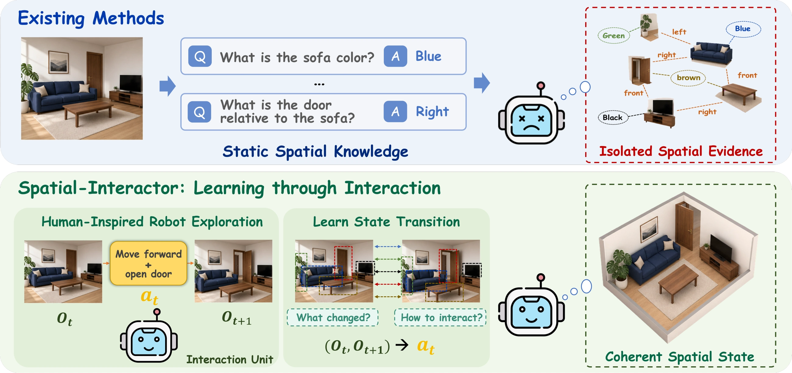
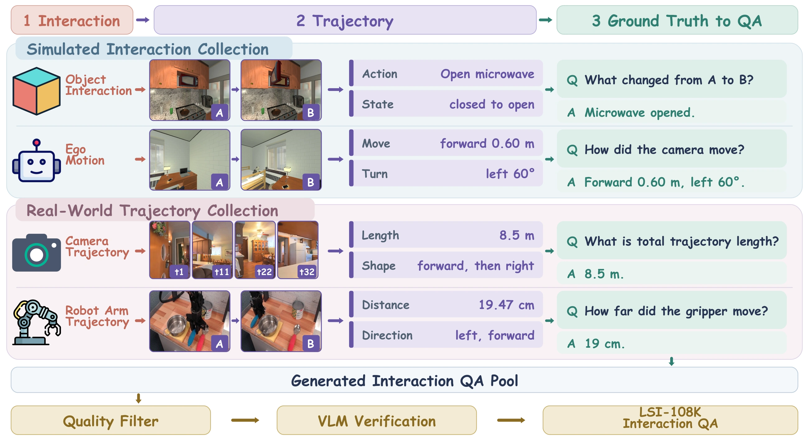

<p align="center">
  
</p>

<h1 align="center">Spatial-Interactor</h1>

<p align="center">
  <strong>Learning Spatial Reasoning through Interaction with the Observable Physical World</strong>
</p>

<p align="center">
  <a href="https://zju-omniai.github.io/Spatial-Interactor/"></a>
  <a href="https://zju-omniai.github.io/Spatial-Interactor/assets/paper.pdf"></a>
  <a href="https://huggingface.co/datasets/kagakouko/LSI-108K"></a>
</p>

<p align="center">
  <a href="https://huggingface.co/kagakouko/Spatial-Interactor-Qwen2.5-VL-3B">Qwen2.5-VL-3B</a> &nbsp;|&nbsp;
  <a href="https://huggingface.co/kagakouko/Spatial-Interactor-Qwen2.5-VL-7B">Qwen2.5-VL-7B</a> &nbsp;|&nbsp;
  <a href="https://huggingface.co/kagakouko/Spatial-Interactor-Qwen3-VL-4B">Qwen3-VL-4B</a> &nbsp;|&nbsp;
  <a href="https://huggingface.co/kagakouko/Spatial-Interactor-Qwen3-VL-8B">Qwen3-VL-8B</a>
</p>

## Introduction

<video controls preload="metadata" poster="https://raw.githubusercontent.com/ZJU-OmniAI/Spatial-Interactor/main/assets/presentation/spatial-interactor-intro-poster.webp" width="100%">
  <source src="https://zju-omniai.github.io/Spatial-Interactor/assets/presentation/spatial-interactor-intro.mp4" type="video/mp4">
</video>

## Presentation

<p align="center">
  
</p>

## Learning from observable change

Spatial reasoning is not only about recognizing relations in a static frame. An
agent must follow how objects, viewpoints, and locations change through
interaction, then integrate those local transitions into a coherent spatial
state. Spatial-Interactor turns observable physical interaction into direct
supervision for this process.

<p align="center">
  
</p>

## A three-level spatial interaction curriculum

The curriculum progresses from **passive world-state transitions (L1)**, to
**active self-state transitions (L2)**, and finally to **long-horizon state
transition integration (L3)**. Together, these levels connect local physical
change with global path understanding.

<p align="center">
  
</p>

## From interaction trajectories to verifiable QA

LSI-108K is constructed from simulator actions, scene states, camera poses,
object tracks, and robot trajectories. Geometric signals are converted into
textual ground truth before task templates produce question-answer pairs,
keeping supervision tied to observable state changes.

<p align="center">
  
</p>

| Level | Samples | Spatial supervision |
|:---:|---:|:---|
| **L1** | 15,109 | Passive world-state transitions |
| **L2** | 69,487 | Active self-state transitions |
| **L3** | 22,922 | Long-horizon transition integration |
| **Total** | **107,518** | **Interaction-derived spatial QA** |

## On-Policy Distillation

Training first uses L1 and L2 to establish local state-transition modeling.
For L3, On-Policy Distillation (OPD) combines verifiable answer rewards with a
training-only privileged transition trace. The teacher and student evaluate the
same student-generated prefixes; process distillation is applied to reasoning
tokens, while answer rewards supervise the final result. At inference, the
model receives only the original image or video and question.

<p align="center">
  
</p>

## Repository layout

```text
data_generation/       interaction and privileged-trace construction
data_preparation/      curriculum, SFT-mixture, and OPD-data builders
training/sft/          LLaMA-Factory snapshot and full SFT launcher
training/opd/          EasyR1-based OPD, reward, and GRPO implementation
docs/                  method-to-code and reproduction notes
tests/                 lightweight data and objective tests
```

## Prepare the data

Create the portable Hugging Face annotation release from generated records:

```bash
python data_preparation/prepare_release_dataset.py \
  --input /data/generated/*.jsonl \
  --output-dir /data/LSI-108K \
  --paper-counts
```

Build the reported SFT mixture:

```bash
python data_preparation/assign_curriculum_levels.py \
  --input /data/generated/*.jsonl \
  --output-dir /data/lsi_curriculum \
  --paper-counts

python data_preparation/build_sft_mixture.py \
  --l1 /data/lsi_curriculum/lsi_l1.jsonl \
  --l2 /data/lsi_curriculum/lsi_l2.jsonl \
  --vsi /data/vsi_50k.jsonl \
  --mindcube /data/mindcube_10k.jsonl \
  --vsti /data/vsti_20k.jsonl \
  --output-dir /data/spatial_interactor_sft
```

The reported SFT mixture uses 13,109 single-transition L1 records, all 69,487
L2 records, VSI (50,000), MindCube (10,000), and VSTI (20,000). The remaining
2,000 multi-stage operation records are released in L1 but are not part of the
reported SFT run.

## Train Spatial-Interactor

Run one-epoch BF16 full-parameter SFT. The vision tower is frozen; the language
model and multimodal projector are updated. The default global batch is 64.

```bash
MODEL_PATH=/models/qwen-vl \
DATA_DIR=/data/spatial_interactor_sft \
OUTPUT_DIR=/outputs/spatial_interactor_sft \
MODEL_FAMILY=qwen25vl \
GPUS=0,1,2,3,4,5,6,7 \
bash training/sft/train_sft.sh
```

Use `MODEL_FAMILY=qwen3vl` for Qwen3-VL.

Build question-independent privileged traces from 32 chronological frames:

```bash
python data_generation/build_trace_manifest.py \
  --input /data/lsi_curriculum/lsi_l3_roomtour_10912.jsonl /data/vsti_11k.jsonl \
  --data-root /data/media \
  --output /data/traces/manifest.jsonl

export VLM_API_KEY='your-key'
export VLM_BASE_URL='https://your-openai-compatible-endpoint'
export VLM_MODEL='your-frozen-strong-vlm'

python data_generation/generate_privileged_traces.py \
  --manifest /data/traces/manifest.jsonl \
  --data-root /data/media \
  --output /data/traces/traces.jsonl \
  --frame-cache /data/traces/frame_cache \
  --workers 4
```

Build the OPD split and launch training:

```bash
python data_preparation/build_opd_dataset.py \
  --l3 /data/lsi_curriculum/lsi_l3_roomtour_10912.jsonl \
  --vsti /data/vsti_11k.jsonl \
  --traces /data/traces/traces.jsonl \
  --data-root /data/media \
  --output-dir /data/spatial_interactor_opd \
  --paper-counts

MODEL_PATH=/outputs/spatial_interactor_sft \
DATA_DIR=/data/spatial_interactor_opd \
MEDIA_ROOT=/data/media \
OUTPUT_ROOT=/outputs/opd \
PYTHON_BIN=/path/to/easyr1-env/bin/python \
GPUS=0,1,2,3,4,5,6,7 \
bash training/opd/scripts/train_opd.sh
```

The paper defaults are 16 prompts per step, 8 rollouts per prompt, 32 frames,
temperature 0.8, top-p 0.9, a 384-token response limit, reference KL weight
0.01, and OPD weight 0.05. The OPD weight is held for 100 steps and decays to
zero over the next 1,100 steps. No vocabulary-wise pointwise KL clipping is
used.

The matched answer-only GRPO ablation uses the same initialization, data,
prompts, rollouts, and rewards:

```bash
MODEL_PATH=/outputs/spatial_interactor_sft \
DATA_DIR=/data/spatial_interactor_opd \
MEDIA_ROOT=/data/media \
OUTPUT_ROOT=/outputs/grpo \
PYTHON_BIN=/path/to/easyr1-env/bin/python \
GPUS=0,1,2,3,4,5,6,7 \
bash training/opd/scripts/train_grpo.sh
```

## Verification and documentation

```bash
bash scripts/check_release.sh
```

See [Data](docs/DATA.md), [OPD](docs/OPD.md),
[Environment](docs/ENVIRONMENT.md), [Reproducibility](docs/REPRODUCIBILITY.md),
and [Method-to-code mapping](docs/METHOD_TO_CODE.md) for implementation details.
